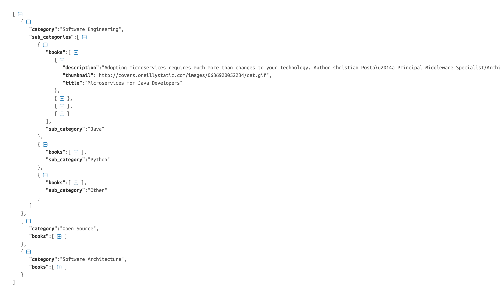
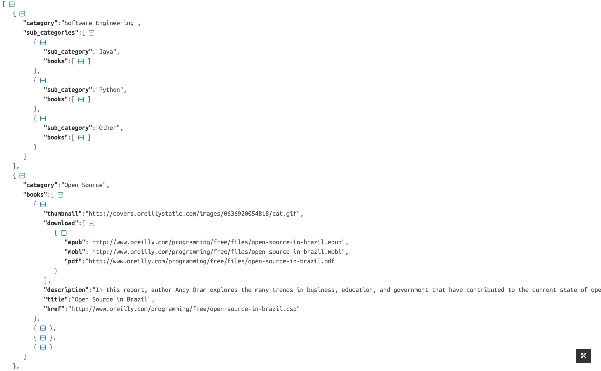

api-oreilly-books-free
--------------------------

The main goal of this project is practiced web scraping technical and help other people to do more easy the download awesome books of programming section.

Web Scraping to download books of the section "programming" from [o'reilly free books](http://www.oreilly.com/programming/free/).

Tools used on the sample project
------------------------------------
* [Python 2.7][0]
* [App Engine][1]
* [BS4 - BeautifulSoup][2]
* [WebApp2][3]

O'reilly Free Books API REST
--------------------------
https://api-oreilly-free.appspot.com/oreilly-free

### O'reilly Programming

### O'reilly Download

Install
-------
* Install App Engine
* Install Google App Engine Launcher
* Download project
* file -> add existing application -> add -> run .

Do you want to contribute?
--------------------------
Feel free to report or add any useful feature, I will be glad to improve it with your help!.

Developed By
------------

* Erik González  - <erikcaffrey10@gmail.com>

License
-------

    Copyright 2017 Erik Jhordan Rey 

    Licensed under the Apache License, Version 2.0 (the "License");
    you may not use this file except in compliance with the License.
    You may obtain a copy of the License at

       http://www.apache.org/licenses/LICENSE-2.0

    Unless required by applicable law or agreed to in writing, software
    distributed under the License is distributed on an "AS IS" BASIS,
    WITHOUT WARRANTIES OR CONDITIONS OF ANY KIND, either express or implied.
    See the License for the specific language governing permissions and
    limitations under the License.

[0]: https://www.python.org/download/releases/2.7/
[1]: https://www.crummy.com/software/BeautifulSoup/bs4/doc/
[2]: https://cloud.google.com/appengine/docs/python/
[3]: https://cloud.google.com/appengine/docs/python/getting-started/handling-user-input-form
